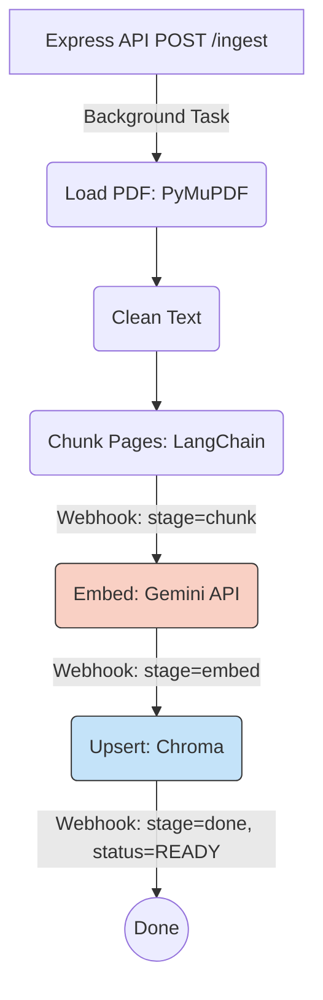

# Step 6: FastAPI Ingestion Pipeline (Gemini + Chroma)

This document outlines the implementation details for **Step 6** of the DocVault project, which replaces the simulated ingestion pipeline in the `docvault-rag` FastAPI service with a real architecture using **PyMuPDF**, **LangChain**, **Google Gemini embeddings**, and a **Chroma DB** vector store.

---

## 🏗️ Architecture & Flow

The pipeline is triggered asynchronously via a `BackgroundTasks` queue when the Express API calls the `POST /ingest` endpoint.



### Pipeline Stages Breakdown

1. **Load PDF**: Uses `PyMuPDF` (`fitz`) to extract text page-by-page. Pages with fewer than `MIN_PAGE_CHARS` are skipped (to filter out blank or image-only pages).
2. **Clean Text**:
   - Normalises whitespace (collapses multiple spaces/newlines).
   - Strips standalone page numbers using Regex.
   - Detects and removes repeating headers/footers (lines appearing identically on >70% of pages).
3. **Chunk**: Uses local LangChain `RecursiveCharacterTextSplitter` (chunk size 800, overlap 100). Chunking is done strictly _per page_ to ensure page-number metadata is perfectly accurate for every chunk.
4. **Embed**: Batches text chunks (default 25 chunks per batch) and calls Google's `models/text-embedding-004` via `google-generativeai`. Features automatic exponential backoff (retries up to 3 times on rate limit errors).
5. **Upsert**: Saves the chunks and embeddings into a persistent local `chromadb` store. Uses highly deterministic IDs (`{docId}_{page}_{chunkIndex}`) so that re-ingesting a document cleanly overwrites previous entries with no duplicates.
6. **Webhooks**: At each major stage (Chunking complete, Batch embedded, Upsert complete, or Failure), a lightweight webhook is fired back to the Express API (`/internal/docs/:docId/progress`) to update the user interface in real-time.

---

## 📁 File Structure Map

### New Modules (`docvault-rag/app/`)

- **`core/security.py`** - Internal API key validation dependency.
- **`core/chroma.py`** - Singleton `PersistentClient` for Chroma DB connections.
- **`core/gemini.py`** - Wrapper for `google-generativeai` batch embeddings + retry logic.
- **`core/notify.py`** - Non-fatal `httpx` webhook client for talking to Express.
- **`schemas/ingest.py`** - Pydantic definitions for request payloads.
- **`services/pdf_loader.py`** - PyMuPDF extraction logic.
- **`services/text_cleaner.py`** - Whitespace and header/footer cleanup algorithms.
- **`services/chunker.py`** - LangChain RecursiveCharacterTextSplitter.
- **`services/ingest_service.py`** - The primary orchestration function tying the pipeline together.

### Modified Files

- **`app/routes/ingest.py`** - Replaced the fake pipeline stub with robust validation and the real `run_ingestion` invocation.
- **`app/core/config.py`** - Integrated new environment variables using `pydantic-settings`.
- **`requirements.txt`** - Added `pymupdf`, `langchain-text-splitters`, `google-generativeai`, `chromadb`.
- **`.env.example`** and **`.env`** - Updated configurations (see below).

---

## ⚙️ Environment Configuration

Add the following to your `docvault-rag/.env`:

```env
# Required Services
INTERNAL_RAG_KEY=YOUR_SHARED_SECRET    # Must match Express
GEMINI_API_KEY=your_gemini_api_key     # Get from Google AI Studio
API_SERVICE_URL=http://localhost:4000  # Express webhook target

# Processing Tuning
MIN_PAGE_CHARS=50
EMBEDDINGS_MODEL=models/text-embedding-004
EMBED_BATCH_SIZE=25
EMBED_BATCH_DELAY_MS=200

# Storage Locations (relative to project root)
FILE_STORAGE_PATH=../shared-storage
CHROMA_PATH=./chroma
```

---

## ⚠️ Python 3.14 + Chromadb Compatibility

> **Note:** DocVault utilizes **Python 3.14**. The only stable Chromadb release with pre-built Windows wheels is version `1.5.2`. However, this version relies internally on a `pydantic.v1` compatibility shim which was fully removed from standard libraries in Python 3.14.

To make Chromadb work on Python 3.14, a one-off monkey patch was applied exclusively to the virtual environment's `chromadb/config.py`.

If you ever destroy and recreate the `.venv`, you **must** re-apply the patch right after running `pip install`:

```bash
# from the docvault-rag/ folder
.\.venv\Scripts\activate
pip install -r requirements.txt

# Run the automated patcher
python patch_chromadb.py
```

_(The patch automatically refactors Chromadb to natively utilize `pydantic-settings` v2 features)._

---

## ✅ End-to-End Verification

1. Provide valid configurations in `.env` for **both** `docvault-api` and `docvault-rag`.
2. Boot both servers:
   - Express: `npm run dev`
   - FastAPI: `uvicorn app.main:app --reload`
3. Upload a PDF to the Express backend.
4. Watch the `docvault-rag` console logs output:
   - `[ingest_service] START docId=...`
   - `[chunker] produced N chunks...`
   - `[gemini] embedding batch X...`
   - `[ingest_service] upserted N chunks to Chroma...`
   - `[ingest_service] DONE docId=... -> READY`

### Checking the Database

Run this snippet inside the `docvault-rag/` directory to inspect the vectorized data:

```python
import chromadb

# Connect to persistent storage
client = chromadb.PersistentClient(path="./chroma")
col = client.get_collection("docvault_chunks")

print(f"Total embedded chunks in DB: {col.count()}")

# Peek at specific document metadata
results = col.get(limit=3, include=["documents", "metadatas"])
for doc, meta in zip(results["documents"], results["metadatas"]):
    print(f"Page {meta['page']}, Chunk {meta['chunkIndex']}: {doc[:50]}...")
```
