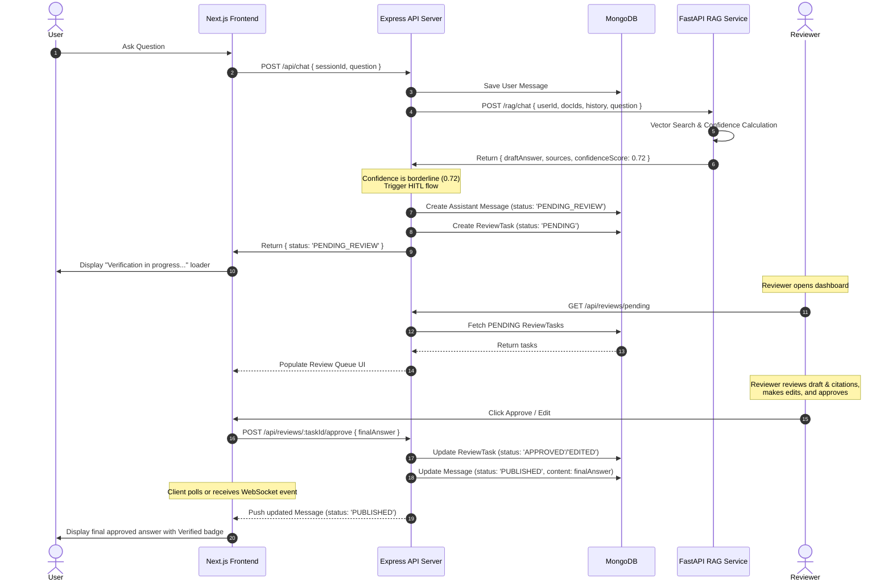

# DocVault Human-in-the-Loop (HITL) Architecture & Workflow

This document provides a detailed breakdown of the recommended Human-in-the-Loop (HITL) workflow for the DocVault RAG system. It describes the routing strategy, data models, state transitions, and integration coordinates across the frontend, Express API orchestrator, and FastAPI RAG service.

---

## 1. Core Architectural Strategy: Confidence-Based Routing

Rather than reviewing every single RAG query—which would ruin user experience with unacceptable latency—DocVault will use a **Confidence-Based Routing** strategy.

### Routing Rules

```
                ┌───────────────────────────┐
                │       User Question       │
                └─────────────┬─────────────┘
                              │
                              ▼
                ┌───────────────────────────┐
                │   Query Vector Search     │
                └─────────────┬─────────────┘
                              │
                              ▼
                ┌───────────────────────────┐
                │ Calculate Confidence (CS) │
                └─────────────┬─────────────┘
                              │
            ┌─────────────────┼─────────────────┐
            │                 │                 │
            ▼ [CS >= 0.85]    ▼ [0.60 <= CS < 0.85]  ▼ [CS < 0.60]
     ┌─────────────┐   ┌─────────────┐   ┌─────────────┐
     │ Auto-Answer │   │ Human Queue │   │ Auto-Refuse │
     └─────────────┘   └─────────────┘   └─────────────┘
```

1. **Auto-Answer ($CS \ge 0.85$)**:
   * **Behavior**: The query retrieval is highly relevant. The system bypasses human review, generates the answer with Gemini 1.5 Flash, and publishes it immediately.
   * **User UX**: Instant response (1-3 seconds).

2. **Human Review ($0.60 \le CS < 0.85$)**:
   * **Behavior**: The retrieval matches are borderline or sparse. The system generates a draft answer using Gemini, flags the message status as `PENDING_REVIEW` in MongoDB, and creates an audit `ReviewTask` in the queue.
   * **User UX**: The user sees a placeholder message: *"Verification in progress. An administrator is validating this response..."*
   * **Reviewer UX**: The task appears on the reviewer’s dashboard. The reviewer can **Approve** (publish the draft), **Edit** (modify the draft text or citations, then publish), or **Reject** (refuse the response).

3. **Auto-Refuse ($CS < 0.60$)**:
   * **Behavior**: The retrieval scores are very poor, representing a high risk of hallucination. The system refuses to answer.
   * **User UX**: Instant fallback response: *"I couldn't find enough relevant information in the selected documents to answer your question."*

---

## 2. Confidence Score Mathematics

Confidence is calculated in the FastAPI RAG service after vector retrieval. Let $K$ be the requested number of top chunks (default: 5) and $N$ be the number of chunks returned that met the distance threshold (where $N \le K$).

For each retrieved chunk $i$, the cosine similarity is derived from the pgvector cosine distance ($\text{dist}_i$):
$$\text{Sim}_i = 1.0 - \text{dist}_i$$

We compute the three component metrics:
1. **Best Match Relevance ($\text{Sim}_1$)**: The similarity score of the top-ranked chunk.
2. **Context Stability ($\overline{\text{Sim}}$)**: The mean similarity of all retrieved chunks:
   $$\overline{\text{Sim}} = \frac{1}{N} \sum_{i=1}^{N} \text{Sim}_i$$
3. **Retrieval Density ($D$)**: The fraction of requested chunks successfully retrieved:
   $$D = \frac{N}{K}$$

The overall **Confidence Score ($CS$)** is the weighted sum:
$$CS = (w_1 \times \text{Sim}_1) + (w_2 \times \overline{\text{Sim}}) + (w_3 \times D)$$

*Recommended Weights*: $w_1 = 0.5$, $w_2 = 0.3$, $w_3 = 0.2$.

---

## 3. Data Flow and State Machine

When a query falls into the **Human Review** threshold range, the system triggers the following workflow:



---

## 4. File-by-File Code Integration Plan

The following files must be updated to implement this architecture:

### 4.1 FastAPI RAG Service (Python)

1. **[retriever.py](file:///c:/Users/minin/Documents/GitHub/DocVault/docvault-rag/app/services/retriever.py)**
   * Add `similarity_score` to the `RetrievedChunk` dataclass.
   * Modify the SQL query in `retrieve_chunks` to return `(embedding <=> vector) as distance` and map it as `similarity_score = 1.0 - distance` (rounded to 4 decimal places).

2. **[rag_chat_service.py](file:///c:/Users/minin/Documents/GitHub/DocVault/docvault-rag/app/services/rag_chat_service.py)**
   * Implement the `calculate_confidence` utility using the formula described in Section 2.
   * Update `run_rag_chat` to invoke confidence calculation and return it as `confidenceScore` in the response payload.

### 4.2 Express API Server (Node.js/TypeScript)

3. **[user.model.ts](file:///c:/Users/minin/Documents/GitHub/DocVault/docvault-api/src/models/user.model.ts)**
   * Add `role: "USER" | "REVIEWER" | "ADMIN"` to the schema to define security groups.

4. **[message.model.ts](file:///c:/Users/minin/Documents/GitHub/DocVault/docvault-api/src/models/message.model.ts)**
   * Add `status: "PUBLISHED" | "PENDING_REVIEW" | "REJECTED"` to the schema.
   * Add `similarityScore: number` to the nested source citation schema.

5. **[chat.service.ts](file:///c:/Users/minin/Documents/GitHub/DocVault/docvault-api/src/services/chat.service.ts)**
   * Integrate the threshold evaluation rules:
     * $CS \ge 0.85$: Publish assistant message directly.
     * $0.60 \le CS < 0.85$: Create message with status `PENDING_REVIEW` and insert a Mongoose `ReviewTask` document. Return metadata notifying the frontend.
     * $CS < 0.60$: Publish refusal text.

6. **[message.repository.ts](file:///c:/Users/minin/Documents/GitHub/DocVault/docvault-api/src/repositories/message.repository.ts)**
   * Modify `listRecentMessagesBySessionForUser` to filter out messages where `status !== 'PUBLISHED'` unless the requesting user has the `REVIEWER` or `ADMIN` role.

---

## 5. Security & Concurrency Considerations

* **RBAC Enforcement**: All reviewer endpoints must be guarded with a custom Express middleware `requireRole(["REVIEWER", "ADMIN"])` validating the JWT claim.
* **Concurrency Lock**: To prevent race conditions if multiple reviewers audit the same task, updates must use an atomic Mongoose filter to lock status:
  ```typescript
  const task = await ReviewTask.findOneAndUpdate(
    { _id: taskId, status: "PENDING" },
    { $set: { status: "APPROVED", reviewedBy: reviewerId, finalAnswer, reviewedAt: new Date() } },
    { new: true }
  );
  if (!task) {
    throw new Error("Task was already reviewed by another administrator.");
  }
  ```
