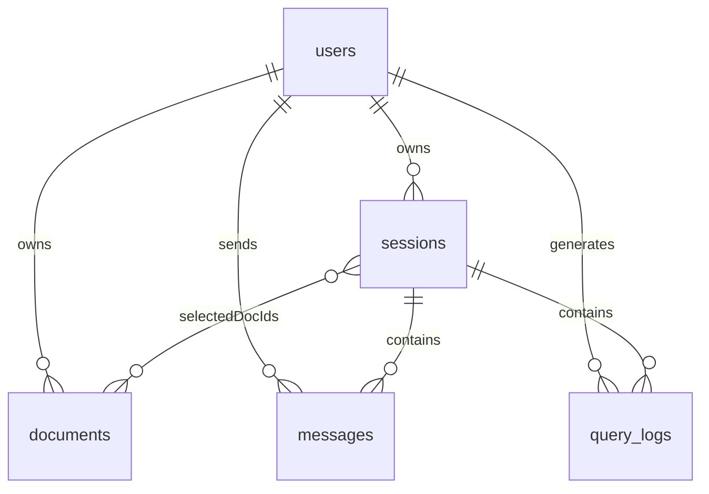

# DocVault — Data Model Reference

> **Step 2 — Last updated:** 2026-03-02  
> This document describes every MongoDB collection stored by `docvault-api`.
> No auth endpoints, upload logic, or RAG calls exist yet; this is schema-only.

---

## Collection Relationships



---

## 1. `users`

Stores registered accounts. Credentials are stored as a bcrypt hash in the `password` field.

### Fields

| Field       | Type     | Required | Notes                                                   |
| ----------- | -------- | -------- | ------------------------------------------------------- |
| `_id`       | ObjectId | auto     | Primary key                                             |
| `email`     | String   | ✅       | Unique, lowercase, trimmed                              |
| `password`  | String   | ✅       | Bcrypt-hashed. Field is `password` (not `passwordHash`) |
| `plan`      | String   | —        | Enum `"FREE"` \| `"PRO"`, default `"FREE"`              |
| `createdAt` | Date     | auto     | Injected by Mongoose timestamps                         |
| `updatedAt` | Date     | auto     | Injected by Mongoose timestamps                         |

### Indexes

- `email` — unique (single-field, ascending)

### Example document

```json
{
  "_id": "64ab1234ef5678901234abcd",
  "email": "alice@example.com",
  "password": "$2b$12$hashedPasswordHere",
  "plan": "FREE",
  "createdAt": "2026-03-01T10:00:00.000Z",
  "updatedAt": "2026-03-01T10:00:00.000Z"
}
```

---

## 2. `documents`

Tracks every file uploaded by a user, including storage location, processing status, and progress.

### Fields

| Field                  | Type     | Required | Notes                                                              |
| ---------------------- | -------- | -------- | ------------------------------------------------------------------ |
| `_id`                  | ObjectId | auto     | Primary key                                                        |
| `userId`               | ObjectId | ✅       | Ref → `users`                                                      |
| `fileName`             | String   | ✅       | Name used on disk (may be UUID-based)                              |
| `originalFileName`     | String   | —        | User-visible original filename                                     |
| `mimeType`             | String   | —        | e.g. `"application/pdf"`                                           |
| `sizeBytes`            | Number   | —        | File size in bytes                                                 |
| `storage.path`         | String   | ✅       | Absolute path under `FILE_STORAGE_PATH`                            |
| `storage.provider`     | String   | —        | Enum `"local"`, default `"local"`                                  |
| `status`               | String   | —        | See **Document Status** below, default `"UPLOADED"`                |
| `progress.totalPages`  | Number   | —        | Set by extraction stage                                            |
| `progress.chunksTotal` | Number   | —        | Set by chunking stage                                              |
| `progress.chunksDone`  | Number   | —        | Incremented during embedding                                       |
| `progress.stage`       | String   | —        | Current stage: `"extract"` \| `"chunk"` \| `"embed"` \| `"upsert"` |
| `error.message`        | String   | —        | Human-readable error description                                   |
| `error.at`             | Date     | —        | When the error occurred                                            |
| `createdAt`            | Date     | auto     | Mongoose timestamps                                                |
| `updatedAt`            | Date     | auto     | Mongoose timestamps                                                |

### Document Status Machine

```
UPLOADED → PROCESSING → READY
                      ↘ FAILED
```

| Status       | Meaning                                              |
| ------------ | ---------------------------------------------------- |
| `UPLOADED`   | File saved to disk; RAG pipeline not started yet     |
| `PROCESSING` | RAG worker is actively extracting/chunking/embedding |
| `READY`      | Embeddings upserted to vector store; queryable       |
| `FAILED`     | Pipeline error; see `error.message` and `error.at`   |

### Indexes

- `{ userId: 1, createdAt: -1 }` — list documents for a user, newest first
- `{ userId: 1, status: 1 }` — filter documents by processing status per user

### Example document

```json
{
  "_id": "64bc2345ef6789012345bcde",
  "userId": "64ab1234ef5678901234abcd",
  "fileName": "550e8400-e29b-41d4-a716-446655440000.pdf",
  "originalFileName": "Q4_Report.pdf",
  "mimeType": "application/pdf",
  "sizeBytes": 2048576,
  "storage": {
    "path": "/app/shared-storage/550e8400-e29b-41d4-a716-446655440000.pdf",
    "provider": "local"
  },
  "status": "READY",
  "progress": {
    "totalPages": 42,
    "chunksTotal": 128,
    "chunksDone": 128,
    "stage": "upsert"
  },
  "error": {},
  "createdAt": "2026-03-01T11:00:00.000Z",
  "updatedAt": "2026-03-01T11:05:30.000Z"
}
```

---

## 3. `sessions`

A chat session groups messages and optionally scopes them to specific documents.

### Fields

| Field            | Type       | Required | Notes                                    |
| ---------------- | ---------- | -------- | ---------------------------------------- |
| `_id`            | ObjectId   | auto     | Primary key                              |
| `userId`         | ObjectId   | ✅       | Ref → `users`                            |
| `title`          | String     | ✅       | User-visible title, default `"New chat"` |
| `selectedDocIds` | ObjectId[] | —        | Refs → `documents`, default `[]`         |
| `createdAt`      | Date       | auto     | Mongoose timestamps                      |
| `updatedAt`      | Date       | auto     | Mongoose timestamps (updated on new msg) |

### Indexes

- `{ userId: 1, updatedAt: -1 }` — list sessions for a user, most recently active first

### Example document

```json
{
  "_id": "64cd3456ef7890123456cdef",
  "userId": "64ab1234ef5678901234abcd",
  "title": "Q4 Report Analysis",
  "selectedDocIds": ["64bc2345ef6789012345bcde"],
  "createdAt": "2026-03-01T12:00:00.000Z",
  "updatedAt": "2026-03-01T12:45:00.000Z"
}
```

---

## 4. `messages`

Individual turns within a session for the conversational chat interface.

### Fields

| Field                  | Type     | Required | Notes                                         |
| ---------------------- | -------- | -------- | --------------------------------------------- |
| `_id`                  | ObjectId | auto     | Primary key                                   |
| `userId`               | ObjectId | ✅       | Ref → `users` (denormalised for fast queries) |
| `sessionId`            | ObjectId | ✅       | Ref → `sessions`                              |
| `role`                 | String   | ✅       | Enum `"user"` \| `"assistant"` \| `"system"`  |
| `content`              | String   | ✅       | Raw text of the message                       |
| `citations[].docId`    | ObjectId | —        | Ref → `documents`                             |
| `citations[].fileName` | String   | —        | Denormalised for display without a join       |
| `citations[].page`     | Number   | —        | Source page number                            |
| `citations[].chunkId`  | String   | —        | Chunk ID in the vector store                  |
| `meta.model`           | String   | —        | LLM model name used                           |
| `meta.latencyMs`       | Number   | —        | End-to-end latency in milliseconds            |
| `createdAt`            | Date     | auto     | Mongoose timestamps                           |
| `updatedAt`            | Date     | auto     | Mongoose timestamps                           |

### Indexes

- `{ sessionId: 1, createdAt: 1 }` — ordered message history for a session
- `{ userId: 1, createdAt: -1 }` — recent message history across sessions

### Example document

```json
{
  "_id": "64de4567ef8901234567defa",
  "userId": "64ab1234ef5678901234abcd",
  "sessionId": "64cd3456ef7890123456cdef",
  "role": "assistant",
  "content": "Based on the Q4 report, revenue grew by 12% year-over-year.",
  "citations": [
    {
      "docId": "64bc2345ef6789012345bcde",
      "fileName": "Q4_Report.pdf",
      "page": 7,
      "chunkId": "chunk_abc123"
    }
  ],
  "meta": {
    "model": "gpt-4o",
    "latencyMs": 1423
  },
  "createdAt": "2026-03-01T12:45:10.000Z",
  "updatedAt": "2026-03-01T12:45:10.000Z"
}
```

---

## 5. `query_logs` _(planned — schema defined, not yet written to)_

Records each RAG retrieval for observability, debugging, and future analytics. The RAG service will emit these records once the pipeline is active.

### Fields

| Field               | Type     | Required | Notes                                   |
| ------------------- | -------- | -------- | --------------------------------------- |
| `_id`               | ObjectId | auto     | Primary key                             |
| `userId`            | ObjectId | ✅       | Ref → `users`                           |
| `sessionId`         | ObjectId | ✅       | Ref → `sessions`                        |
| `query`             | String   | ✅       | User's raw query string                 |
| `retrievedChunkIds` | String[] | —        | Chunk IDs returned by the vector store  |
| `latencyMs`         | Number   | —        | Total retrieval latency in milliseconds |
| `tokens`            | Number   | —        | Token count (prompt + completion)       |
| `createdAt`         | Date     | auto     | Mongoose timestamps                     |
| `updatedAt`         | Date     | auto     | Mongoose timestamps                     |

### Indexes

- `{ sessionId: 1, createdAt: -1 }` — logs per session, newest first
- `{ userId: 1, createdAt: -1 }` — logs per user for analytics

### Example document

```json
{
  "_id": "64ef5678ef9012345678efab",
  "userId": "64ab1234ef5678901234abcd",
  "sessionId": "64cd3456ef7890123456cdef",
  "query": "What was the revenue growth in Q4?",
  "retrievedChunkIds": ["chunk_abc123", "chunk_def456", "chunk_ghi789"],
  "latencyMs": 340,
  "tokens": 1820,
  "createdAt": "2026-03-01T12:45:09.000Z",
  "updatedAt": "2026-03-01T12:45:09.000Z"
}
```

---

## Summary Index Reference

| Collection   | Index                             | Purpose                            |
| ------------ | --------------------------------- | ---------------------------------- |
| `users`      | `{ email: 1 }` unique             | Email lookup on login/register     |
| `documents`  | `{ userId: 1, createdAt: -1 }`    | User's document list, newest first |
| `documents`  | `{ userId: 1, status: 1 }`        | Filter by processing state         |
| `sessions`   | `{ userId: 1, updatedAt: -1 }`    | Recent sessions sidebar            |
| `messages`   | `{ sessionId: 1, createdAt: 1 }`  | Chat history ordering              |
| `messages`   | `{ userId: 1, createdAt: -1 }`    | Cross-session recent messages      |
| `query_logs` | `{ sessionId: 1, createdAt: -1 }` | Debug log per session              |
| `query_logs` | `{ userId: 1, createdAt: -1 }`    | Usage analytics per user           |
